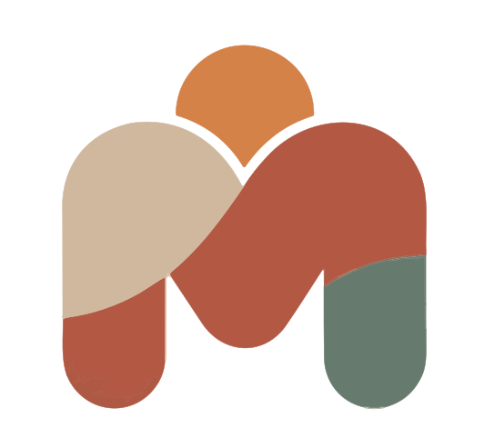
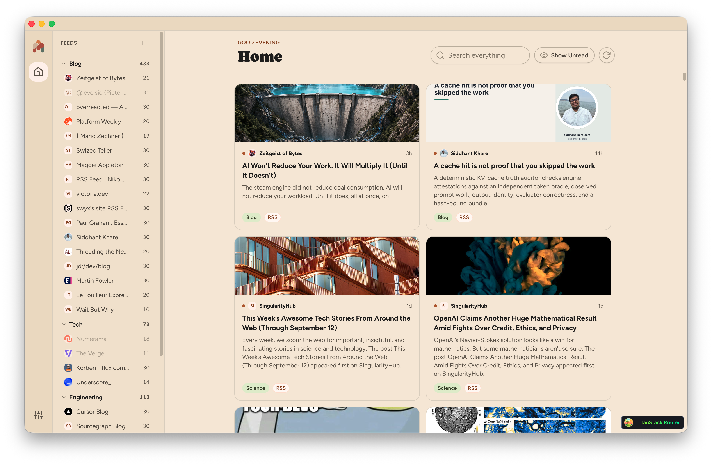

  

<h1 align="center">Monfil</h1>

What if you could reclaim control over the algorithm and create your own news feed?

Monfil helps you doing exactly that by choosing and filtering your own sources of information. It currently supports RSS and Youtube channels, but aims to support other formats in the future, such as atmosphere content (Bluesky), podcasts, subreddits and even regular websites.

It means "My feed" in french.

➡️ ["Hate “The Algorithm?” RSS Is One of the Tools You’ve Been Looking For"](https://www.eff.org/deeplinks/2026/06/hate-algorithm-rss-one-tools-youve-been-looking)

## Usage

- Add a feed with the '+' button at the top.
- Remove a feed with a right-click in the sidebar.
- Set a feed/folder visibility on hovering from the sidebar.

