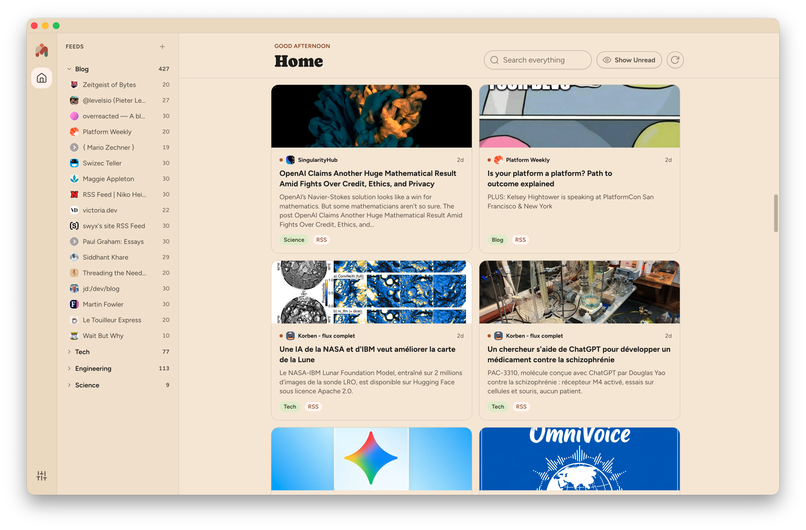
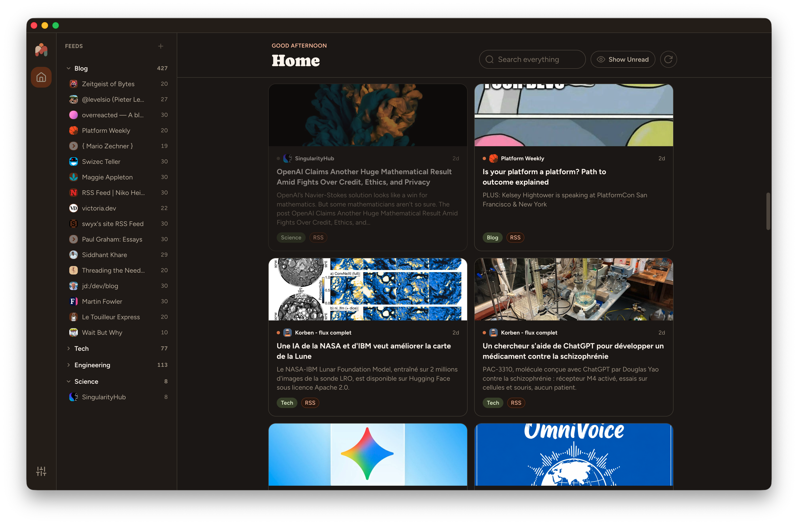

<p align="center">
  
</p>

<h1 align="center">Monfil</h1>

<p align="center">What if you could reclaim control over the algorithm and create your own news feed?</p>

Monfil helps you doing exactly that by choosing and filtering your own sources of information. It currently supports RSS and Youtube channels, but aims to support other formats in the future, such as atmosphere content (Bluesky), podcasts, subreddits and even regular websites.

It means "My feed" in french.

➡️ ["Hate “The Algorithm?” RSS Is One of the Tools You’ve Been Looking For"](https://www.eff.org/deeplinks/2026/06/hate-algorithm-rss-one-tools-youve-been-looking)

[](https://github.com/theopnv/monfil/actions/workflows/publish.yml)

<p align="center">
  
  
</p>
<p align="center">
  
</p>

## Features

- 🪡 **Your own sources.** Add RSS/Atom feeds and YouTube channels by pasting any link; monfil figures out what it is. Support for more source types (Bluesky, podcasts, subreddits, plain websites) is planned.
- 🗂️ **Folders.** Group feeds into folders, and show or hide any feed or folder from Home with a click.
- 🌗 **Light, dark, or system theme.**
- 🔐 **Local and private.** Everything lives in a single SQLite database on your machine. No account, no server, no tracking. Settings shows exactly how many feeds/articles you have and how big that file is, and can reveal it in Finder/Explorer.

## Install

1. Go to the [Releases page](https://github.com/theopnv/monfil/releases) and open the latest version.
2. Download the file that matches your OS:
   - **macOS (Apple Silicon)**: `monfil-darwin-arm64-<version>.zip`
   - **Windows**: `monfil-<version>.Setup.exe`
   - **Linux (Debian/Ubuntu)**: `monfil_<version>_amd64.deb`
   - **Linux (Fedora/RHEL)**: `monfil-<version>-1.x86_64.rpm`
3. Install it like you would any other app for your OS.

### Why does my OS warn me about this app?

Monfil isn't code-signed. Signing costs money every year ($100/year for an Apple Developer account to sign macOS builds, and a paid certificate for Windows) and this is a free, one-person open source project, so that cost isn't covered. That means both macOS and Windows will flag monfil as coming from an "unidentified developer." This is a warning about the *lack of a paid signature*, not a sign that the app is unsafe: every line of monfil's code is public in this repository for anyone to read, and the [release build](.github/workflows/publish.yml) is produced straight from that source, in the open, by GitHub's own servers.

**macOS**: opening the app shows *"monfil.app is damaged and can't be opened."* This is Gatekeeper reacting to the missing signature, not an actually broken download. Open Terminal and run:

```bash
xattr -cr /Applications/monfil.app
```

(use the actual path if you didn't install it to `/Applications`). This clears the "downloaded from the internet" flag Gatekeeper is reacting to. Then open monfil as usual.

**Windows**: SmartScreen shows *"Windows protected your PC."* Click **More info**, then **Run anyway**. No terminal step needed, this is a one-time click per install.

**Linux**: no extra step. Install the `.deb` (`sudo apt install ./monfil_<version>_amd64.deb`) or the `.rpm` (`sudo rpm -i monfil-<version>-1.x86_64.rpm`) directly.

## Usage

- Add a feed with the '+' button at the top of the sidebar, or the "Add your first feed" button on an empty Home.
- Paste a link to an RSS feed, a YouTube channel, a handle, or a video. Monfil resolves what it points to.
- Put it in a folder, existing or new, then confirm.
- Create a folder with the folder icon next to '+' in the sidebar.
- Right-click a folder to rename or delete it. Deleting one asks where to move its feeds first, unless it's already empty.
- Drag a feed onto a folder to move it there.
- Remove a feed with a right-click on it in the sidebar.
- Click an item to open it in the reader; use `j`/`k`/`Esc` to move around without the mouse.
- Open Settings (gear icon) to change theme, density, refresh interval, and reading behavior.

## FAQ

**Why does this exist? Don't RSS readers already exist?**
Plenty do. Monfil exists because most ways of following the internet today hand curation to an algorithm optimizing for engagement, not for what you actually asked for. An RSS reader is the opposite: you choose exactly what shows up, nothing more, nothing less. Monfil is a bet that this idea is worth a modern, pleasant interface instead of stopping at "it's for power users."

**Is my data private?**
Yes. Monfil has no account, no server, and no analytics. Everything — your feeds, your read state, your articles — lives in one SQLite file on your machine. Settings shows you exactly how big it is and can reveal it in Finder/Explorer.

**Is there a mobile app?**
Not currently. Monfil is a desktop app (macOS, Windows, Linux) built with Electron. There's no mobile version planned right now.

**Is monfil free?**
Yes, and it's [MIT-licensed](LICENSE) open source. No ads.

**How do I report a bug or request a feature?**
Open an issue on GitHub. Read [CONTRIBUTING.md](CONTRIBUTING.md) first if you're planning to send a pull request — small, focused PRs are easiest to review.

