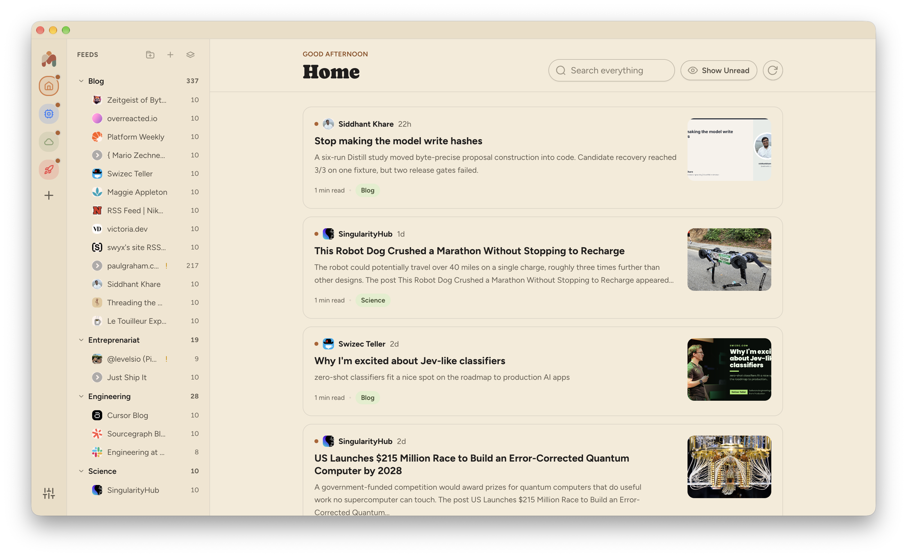
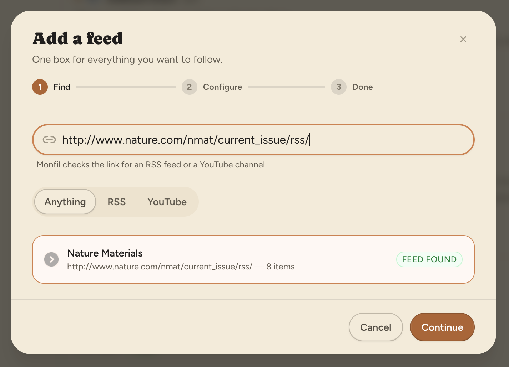
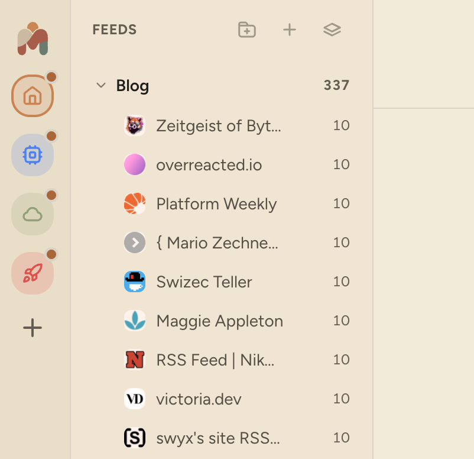
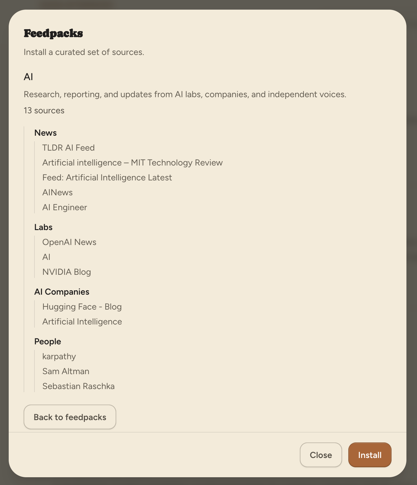
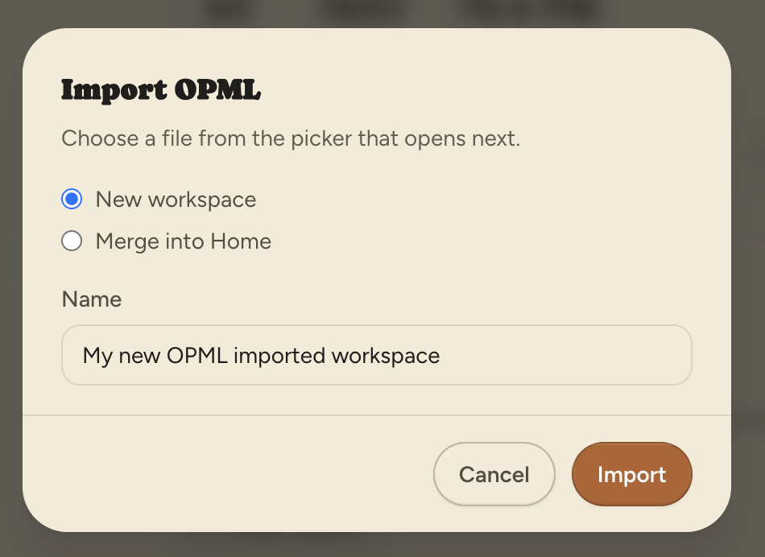
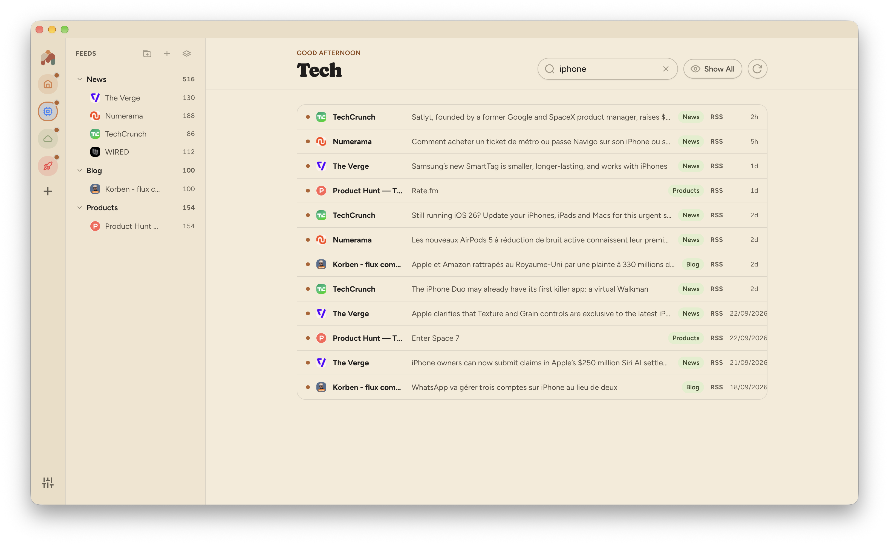
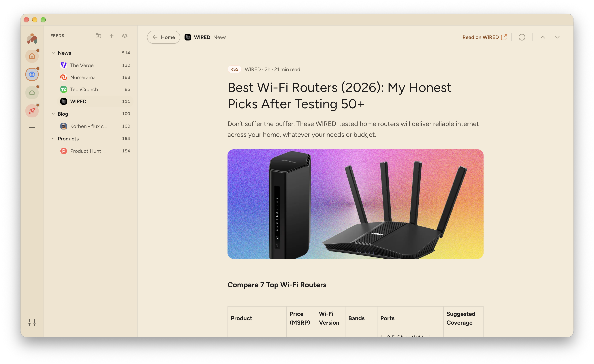
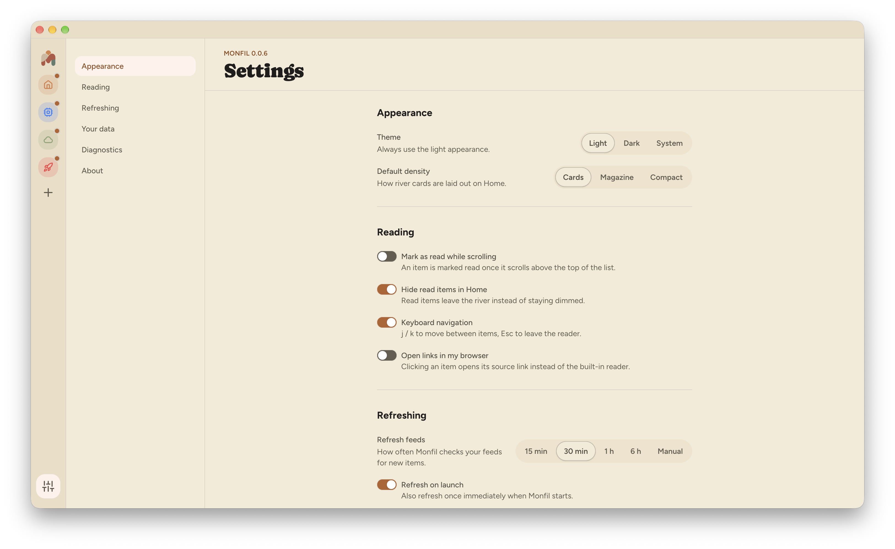

[Install Monfil](../install/) before you start. Monfil opens in Home. Your workspaces are in the narrow rail on the left. The next sidebar holds your feeds and folders. Articles from the selected workspace appear in the main area.

## Add a feed

1. Select **+** at the top of the feed sidebar. On an empty Home, you can select **Add your first feed** instead.
2. Paste a link to an RSS feed or a YouTube channel. A YouTube handle or video link also works. Monfil checks the link and shows the feed it finds.
3. Select **Continue**. Choose a folder under **Put it in**, or select **+ New category** to make one. The folder will appear in the feed sidebar.
4. Select **Add source**. Monfil adds recent items from that feed. Select **Go to feed** to finish, or **Add another** to keep going.

If Monfil finds the wrong source, go back and try a more direct feed or channel link. You can select **RSS** or **YouTube** above the result to narrow the search.

## Organize feeds

Select the folder icon beside **+** in the feed sidebar to make a folder. Type its name and press **Enter**. Drag a feed onto a folder to move it. To rename or delete a folder, right-click it. If the folder has feeds, Monfil asks where to move them before it deletes the folder. Right-click a feed to remove it.

## Workspaces

A workspace groups feeds and folders around a subject, such as work or hobbies. Each workspace has its own feed list and article list. Monfil opens in **Home**. Select a workspace icon in the narrow left rail to switch to it.

### Add a workspace

1. Select **+** in the left rail.
2. Enter a name. Choose an icon and colour if you want to change the defaults.
3. Select **Create workspace**. Monfil opens the new workspace. Add feeds with **+** in the feed sidebar.

### Rename or update a workspace

Right-click its icon in the left rail and select **Edit workspace**. Change its name, icon, or colour, then select **Save changes**. To change its sources, open the workspace and add feeds or organize its folders in the feed sidebar.

### Delete a workspace

Right-click its icon and select **Delete workspace**. The confirmation window offers **Export as OPML** if you want to save its feed list. Select **Delete workspace** to remove the workspace and its folders. Monfil also removes feeds that appear only in that workspace. Feeds in other workspaces stay there. **Home** stays available and has no delete command.

## Start with a feedpack

A feedpack is a curated set of sources on one subject. Select the feedpack icon at the top of the feed sidebar, or select **Browse feedpacks** while making a workspace. An empty workspace also has an **Import feedpack** button.

Choose a pack to see its sources, then select **Install**. When you open the browser from the feed sidebar, Monfil adds the pack to the current workspace. When you open it while making a workspace, Monfil makes a new workspace for the pack.

You can [submit a feedpack](../submit-a-feedpack/) when you have a source collection to share.

## Import or export a list of feeds

OPML is a file format for moving feed lists between readers. To import one, open **Settings**, go to **Your data**, and select **Import OPML**. Choose **New workspace** or **Merge into Home**, then select **Import** and pick the file. In an empty workspace, **Import OPML** adds the feeds to that workspace.

To save a workspace as an OPML file, right-click its icon in the left rail and select **Export as OPML**. Choose where to save the file. You can use it later as a copy of that workspace's feed list.

## Read and find articles

Select an article in the main list to open it in Monfil's reader. Use **Search everything** above the list to find articles in the current workspace. Select **Show Unread** to hide read items, and select **Show All** to bring them back. The refresh button beside it checks your feeds for new items.

For keyboard controls, open **Settings** and turn on **Keyboard navigation** under **Reading**. Then use `j` and `k` to move between articles. Press `Esc` to leave the reader.

## Change your settings

Select the settings icon at the bottom of the left rail. Under **Appearance**, choose a theme and the layout density for article cards. **Reading** controls what happens as you scroll and whether links open in your browser. Under **Refreshing**, choose how often Monfil checks for new items. **Your data** lets you back up the database or reveal its file on your computer.

Read the [privacy notice](../privacy/) for details about local data and requests to other sites.
